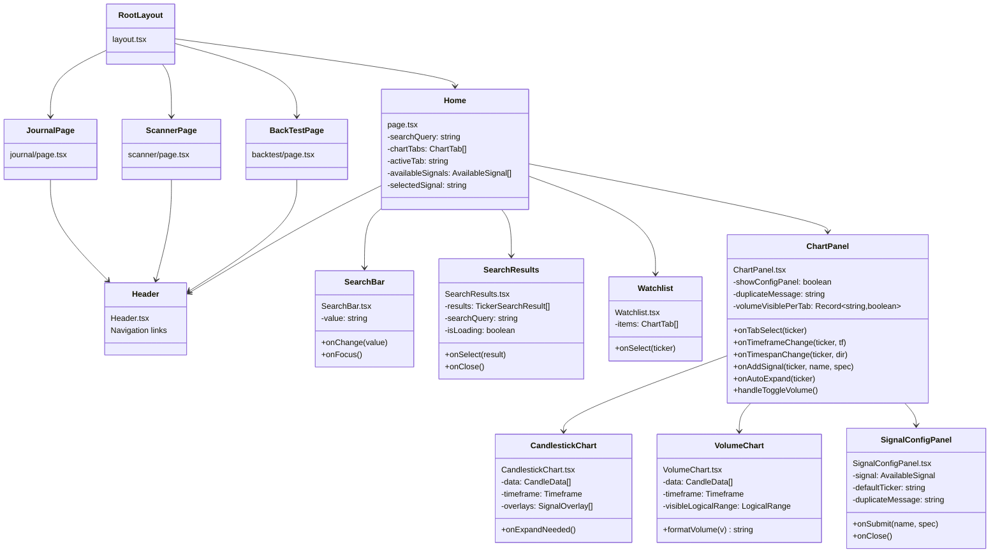

```mermaid
classDiagram
    class RootLayout {
        layout.tsx
    }

    class Home {
        page.tsx
        -searchQuery: string
        -chartTabs: ChartTab[]
        -activeTab: string
        -availableSignals: AvailableSignal[]
        -selectedSignal: string
    }

    class BackTestPage {
        backtest/page.tsx
    }

    class ScannerPage {
        scanner/page.tsx
    }

    class JournalPage {
        journal/page.tsx
    }

    class Header {
        Header.tsx
        Navigation links
    }

    class SearchBar {
        SearchBar.tsx
        -value: string
        +onChange(value)
        +onFocus()
    }

    class SearchResults {
        SearchResults.tsx
        -results: TickerSearchResult[]
        -searchQuery: string
        -isLoading: boolean
        +onSelect(result)
        +onClose()
    }

    class Watchlist {
        Watchlist.tsx
        -items: ChartTab[]
        +onSelect(ticker)
    }

    class ChartPanel {
        ChartPanel.tsx
        -showConfigPanel: boolean
        -duplicateMessage: string
        -volumeVisiblePerTab: Record~string,boolean~
        +onTabSelect(ticker)
        +onTimeframeChange(ticker, tf)
        +onTimespanChange(ticker, dir)
        +onAddSignal(ticker, name, spec)
        +onAutoExpand(ticker)
        +handleToggleVolume()
    }

    class CandlestickChart {
        CandlestickChart.tsx
        -data: CandleData[]
        -timeframe: Timeframe
        -overlays: SignalOverlay[]
        +onExpandNeeded()
    }

    class VolumeChart {
        VolumeChart.tsx
        -data: CandleData[]
        -timeframe: Timeframe
        -visibleLogicalRange: LogicalRange
        +formatVolume(v) string
    }

    class SignalConfigPanel {
        SignalConfigPanel.tsx
        -signal: AvailableSignal
        -defaultTicker: string
        -duplicateMessage: string
        +onSubmit(name, spec)
        +onClose()
    }

    RootLayout --> Home
    RootLayout --> BackTestPage
    RootLayout --> ScannerPage
    RootLayout --> JournalPage

    Home --> Header
    Home --> SearchBar
    Home --> Watchlist
    Home --> SearchResults
    Home --> ChartPanel

    BackTestPage --> Header
    ScannerPage --> Header
    JournalPage --> Header

    ChartPanel --> CandlestickChart
    ChartPanel --> VolumeChart
    ChartPanel --> SignalConfigPanel
```
